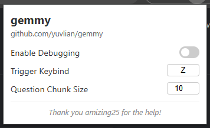
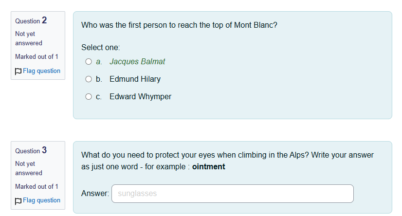

# gemmy

chrome extension that lets you use gemini to solve moodle quizzes secretly!

thank you amizing25 for helping me finish this :>



## setup

1. run these:
   ```bash
   git clone https://github.com/yuvlian/gemmy.git
   cd gemmy
   npm install
   npm run build
   ```
2. open `chrome://extensions` in your browser
3. enable `Developer mode` and click `Load unpacked`
4. select the `dist` directory generated by the build

## how it works

- the extension watches for trigger key (default `z`) + left click. lets say you do `z + left click`, it parses the quiz DOM, sends the data to the background script, which forwards it to gemini (yes it supports images)

- answers are injected back into the page by editing the existing HTML elements like this:

  

  (see the italic text and gray placeholder text)

## misc
1. **something about errors...**

    the `showError` function in `src/content/trigger.ts` displays an error message as a `<p>` element at the bottom‑left of the page.

    feel free to configure that depending on your "stealth" desires

2. **something about chunks...**

    chunks are kinda broken right now. sometimes it works, sometimes it doesnt. feel free to make a PR.
    
    the quizzes i actually do are like 1 question per page so i dont have a need to fix it.

